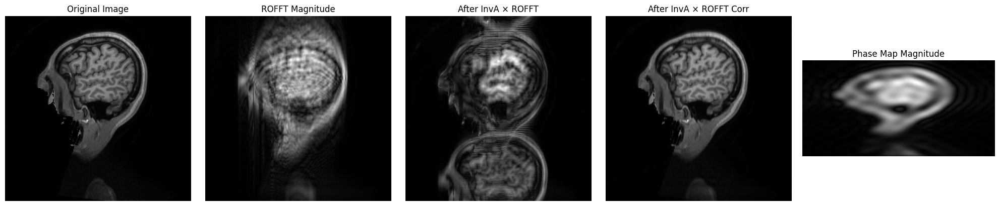

# **SPENPy — SPEN Sequence Simulation in Python**

**SPENPy** is a Python library for simulating the **SPEN (Single Point Encoding)** sequence.
It can generate both *corrupted* and *clean* images, and includes utilities for phase map estimation and reconstruction.

## **Features**

* Simulate SPEN acquisition for grayscale images.
* Generate corrupted images and corresponding phase maps.
* Perform simple reconstruction using the inverse **A** matrix.
* Apply degradation directly via the **A** matrix (faster than full simulation).
* GPU acceleration with PyTorch.
* Easy-to-use demo scripts and Jupyter notebook.

## **Requirements**

Make sure the following Python packages are installed:

```bash
pip install torch torchvision numpy pillow
```

> **Tip:** GPU acceleration is supported if PyTorch is installed with CUDA.

## **Quick Start**

### **1. Simulate and Save Corrupted Image + Phase Map**

```python
from spenpy.spen import spen
from PIL import Image
import torchvision.transforms as T

def save_tensor_as_image(tensor, filename):
    """
    Save a grayscale tensor of shape (H, W) as an image.
    """
    tensor_min, tensor_max = tensor.min(), tensor.max()
    tensor = (tensor - tensor_min) / (tensor_max - tensor_min + 1e-8)
    tensor = (tensor * 255).byte()
    Image.fromarray(tensor.cpu().numpy()).save(filename)

# Load grayscale image
path = "spenpy/data/brain.png"
img = Image.open(path)
img = T.ToTensor()(img)[0]  # Take the first channel

# Run SPEN simulation
final_rxyacq_ROFFT = spen().sim(img.unsqueeze(0))  # Shape: (B, W, H)
phase_map = spen().get_phase_map(img.unsqueeze(0))

# Save results
save_tensor_as_image(final_rxyacq_ROFFT[0].abs(), "corrupted.png")
save_tensor_as_image(phase_map[0].abs(), "phase_map.png")
```

### **2. Simple Reconstruction Using $A^{-1}$**

```python
InvA, _ = spen().get_InvA()

# Apply phase correction to even lines
EvenDataROFFT = final_rxyacq_ROFFT[:, 1::2, :].clone()
EvenDataROFFT *= torch.exp(-1j * phase_map)
FinalryxacqROFFTCorr = final_rxyacq_ROFFT.clone()
FinalryxacqROFFTCorr[:, 1::2, :] = EvenDataROFFT
```

### **3. Fast Degradation Using the A Matrix**

Skip the slow simulation by applying the **A** matrix directly:

```python
_, AFinal = spen().get_InvA()

# Degrade image
degraded_data = torch.matmul(AFinal, img.unsqueeze(0) * 1j)
blur_data = degraded_data.clone()
blur_data[:, 1::2, :] *= torch.exp(1j * phase_map)

# Correct degradation
corr_data = blur_data.clone()
corr_data[:, 1::2, :] *= torch.exp(-1j * phase_map)
corr_data = torch.matmul(InvA, blur_data).clone()
```

## **Demo**

An example workflow is available in **`demo.ipynb`**.



## **Install**

```bash
pip install -e git+https://github.com/txz32102/spenpy.git@main
```